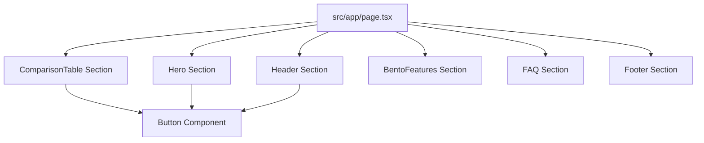

# Technical Architecture & Dev Thinking — PrivacyRank

This document details the frontend architecture, component breakdown, responsive strategy, and implementation challenges for **PrivacyRank**.

---

## 1. Project Folder Structure

We follow a clean, modular Next.js (App Router) structure separating documentation, page routes, reusable components, layout sections, and global styles.

```text
/
├── docs/                     # Documentation (Research, Design, Architecture)
│   ├── research.md
│   ├── design.md
│   └── architecture.md
├── public/                   # Static assets (images, favicon, logo)
├── src/
│   ├── components/           # Reusable UI components (Button, Badge)
│   │   └── Button.tsx
│   ├── sections/             # Page-specific modular layout sections
│   │   ├── Header.tsx
│   │   ├── Hero.tsx
│   │   ├── ComparisonTable.tsx
│   │   ├── ComparisonTable.css
│   │   ├── BentoFeatures.tsx
│   │   ├── FAQ.tsx
│   │   └── Footer.tsx
│   ├── app/                  # Next.js App Router routes & styles
│   │   ├── globals.css
│   │   ├── layout.tsx
│   │   └── page.tsx
├── tsconfig.json
├── package.json
├── next.config.ts
├── CHANGELOG.md
├── README.md
└── PROJECT_CONTEXT.md
```

---

## 2. Component Composition

To ensure a highly maintainable and clean codebase, the layout is broken down into specific modular components:




### Component Roles:
1.  **`Header`**: Fixed-height navigation bar (capped at `72px`). Dynamic active link styling, and single-line layout on desktop. Collapses into a hamburger menu on mobile.
2.  **`Hero`**: Asymmetric presentation with value proposition (H1), subtext, and quick trust CTA buttons. Displays a preview of the Editor's choice or a high-quality product abstract visual.
3.  **`ComparisonTable`**: The conversion engine. Contains a list of 10 VPN services, displaying 5 by default with a "Show More / Show Less" toggle. It transforms dynamically on mobile.
4.  **`VPNCard`**: Represents a single VPN provider (Rank, Logo, Score, Key Specs, Pros/Cons, and CTA) and supports "Get Deal" click-to-copy discount modal popups.
5.  **`BentoFeatures`**: A multi-cell grid highlighting user-centric benefits (One-Click Privacy, Global Streaming, Fast Speeds, and No-Logs Policy) with custom visual animations.
6.  **`FAQ`**: An accordion-based component providing quick, scannable answers to common VPN questions with smooth GSAP open/close height animations, boosting SEO.


---

## 3. Responsive Strategy (Desktop → Mobile)

Every grid and flex system is explicitly defined with mobile-first breakpoints:

*   **Comparison Cards**:
    *   *Desktop (`lg` and above)*: Placed in a horizontal landscape layout where all specs, pros/cons, and CTA are in a single wide row, allowing easy scanning.
    *   *Mobile (`< 768px`)*: Cards stack vertically. The details are rearranged: Logo and Rank go to the top row, ratings next, and Pros/Cons are simplified or collapsed. The CTA button occupies the full width of the card's bottom to optimize thumb clicks.
*   **Bento Grid**:
    *   *Desktop*: 3-column asymmetric layout (e.g., 2/3 width cell paired with a 1/3 cell, then three 1/3 cells).
    *   *Mobile*: Simple 1-column stack. Spacing is reduced from `gap-8` to `gap-4`.
*   **Navigation**:
    *   Responsive navigation menu that collapses into a slide-over mobile drawer or hamburger trigger, preventing double-row nav wrap on medium screens.

---

## 4. Implementation Challenges & Solutions

### A. The Mobile Comparison Challenge
*   *Problem*: Showing complex comparison data (Rank, Logo, Rating, 5+ Features, Pros/Cons, CTA) on a 360px width mobile screen without causing extreme vertical stretching or horizontal scrolling.
*   *Solution*: Instead of forcing a traditional desktop table on mobile (which causes bad UX), we dynamically hide low-priority specs (like wireguard availability which is standard now anyway) on mobile, display only the 3 main "Pros" in a bullet list, and make the rating and CTA the core focus of the mobile card.

### B. Viewport Layout Stability
*   *Problem*: Mobile viewport heights (`100vh`) recalculate on Safari/Chrome when the address bar hides/shows, causing jumpy transitions.
*   *Solution*: Ensure all hero and section elements use `min-h-[100dvh]` or solid rem padding (`py-16` / `py-24`) instead of `h-screen` or `vh` heights to maintain solid layout stability.
